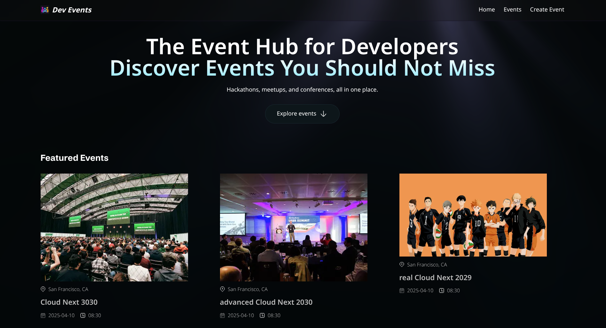
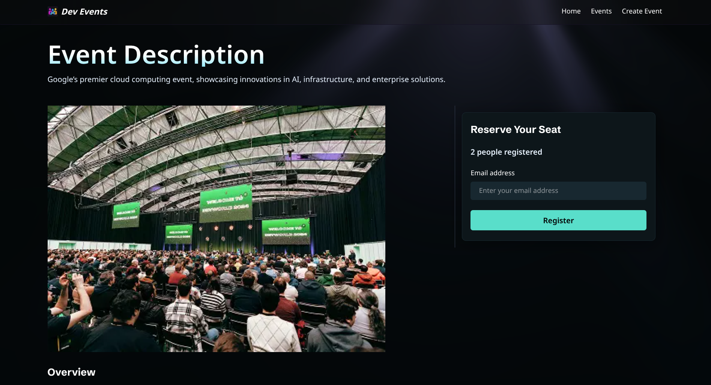

# 📚 BookUrDevEvents

> A production-ready event discovery platform built with **Next.js 16**, **TypeScript**, **MongoDB**, and a modern AI-assisted development workflow.

BookUrDevEvents enables developers to discover hackathons, conferences, workshops, meetups, and technical events through a fast, scalable, and SEO-optimized web application. The project demonstrates full-stack engineering, modern React architecture, production-grade tooling, and performance-focused development practices.

---

## 🚀 Live Demo

https://book-ur-dev-events.vercel.app/

## 📂 Repository

> https://github.com/gnshx/Book-ur-dev-events

---

# ✨ Highlights

* ⚡ Built using **Next.js 15 App Router**
* 🔍 SEO-first architecture with dynamic metadata
* 🌐 Clean slug-based routing for search engine optimization
* 🗄️ MongoDB-backed event management
* 📊 Product analytics powered by PostHog
* 🎯 Fully responsive UI with Tailwind CSS
* 🔄 RESTful API architecture using Route Handlers
* 🤖 AI-assisted development using Cursor AI & Cursor Agent
* ✅ Automated PR reviews with CodeRabbit
* 🛠 Type-safe development with TypeScript
* 🚀 Optimized for performance, scalability, and maintainability

---

# 📖 Project Overview

BookUrDevEvents is a modern developer event discovery platform that aggregates technical events into a clean and intuitive interface.

Rather than focusing only on UI, this project emphasizes:

* Scalable full-stack architecture
* Search engine optimization
* Efficient data fetching
* Modern React patterns
* Reusable component design
* Production-ready engineering practices
* AI-assisted software development workflows

The application follows current Next.js best practices and demonstrates how to build performant, maintainable web applications suitable for real-world deployment.

---

# 🏗️ Architecture

```text
                 Next.js App Router
                        │
        ┌───────────────┼────────────────┐
        │               │                │
     Home Page      Events Page     API Routes
                        │
      ┌─────────────────┴────────────────┐
      │                                  │
 Search & Filters                 Event Details
                                          │
                                   Dynamic Slug Routes
                                          │
                                     MongoDB Database
                                          │
                                Product Analytics
                                     (PostHog)
```

---

# 🚀 Core Features

## 🔍 Event Discovery

* Browse developer events
* Conference listings
* Workshops
* Meetups
* Hackathons
* Search functionality
* Category filtering
* Individual event pages

---

## ⚡ SEO Optimization

SEO was treated as a first-class engineering concern.

### Implemented

* Dynamic Metadata API
* Open Graph tags
* Twitter Cards
* Canonical URLs
* Dynamic sitemap support
* Robots configuration
* Event-specific metadata
* Semantic HTML

### SEO-Friendly URLs

Instead of:

```text
/events?id=123
```

the application generates readable URLs:

```text
/events/google-io-2026
/events/react-india-conference
/events/devfest-hyderabad
```

Benefits include:

* Better Google indexing
* Improved click-through rate
* Shareable URLs
* Improved accessibility
* Cleaner information architecture

---

# ⚡ Next.js 15 Features

Built using the latest App Router architecture.

Implemented:

* App Router
* Server Components
* Client Components
* Nested Layouts
* Dynamic Routes
* Route Handlers
* Loading UI
* Error Boundaries
* Metadata API
* Image Optimization
* Font Optimization

---

# 🗄️ Database Design

MongoDB powers the backend with a scalable document model.

Collections include:

* Events
* Categories
* User Data (future-ready)
* Metadata

Engineering considerations:

* Indexed queries
* Optimized document structure
* Efficient filtering
* Fast search operations
* Scalable schema design

---

# 🔌 Backend APIs

The backend is implemented using Next.js Route Handlers.

Capabilities include:

* Event retrieval
* Event search
* Category filtering
* Slug resolution
* Database operations
* JSON API responses

The API design follows REST principles and keeps business logic modular and maintainable.

---

# 📊 Product Analytics

Integrated **PostHog** for production analytics.

Tracked events include:

* Page views
* Search interactions
* Event engagement
* Popular categories
* User navigation flow
* Feature usage

These insights help drive future product improvements through data-informed decisions.

---

# 🎨 Frontend Engineering

Designed with a strong focus on user experience.

Highlights:

* Mobile-first responsive design
* Reusable UI components
* Clean design system
* Accessible layouts
* Consistent spacing and typography
* Optimized images
* Smooth navigation

---

# ⚡ Performance Optimizations

The application incorporates several performance best practices:

* Server-side rendering (SSR)
* Static rendering where applicable
* Route-level code splitting
* Lazy loading
* Optimized image delivery
* Reduced client-side JavaScript
* Efficient component rendering
* Optimized database queries

---

# 🤖 AI-Assisted Development Workflow

This project incorporates modern AI tooling to improve engineering productivity while maintaining code quality.

## Cursor AI

Used for:

* Component generation
* Boilerplate creation
* Refactoring
* Debugging
* Rapid prototyping
* Code explanation

---

## Cursor Agent

Leveraged autonomous AI agents for:

* Multi-file refactoring
* Project-wide code navigation
* Architecture improvements
* Feature implementation
* Productivity acceleration

---

## CodeRabbit

Integrated CodeRabbit into the GitHub workflow for AI-powered pull request reviews.

Benefits:

* Automated code reviews
* Bug detection
* Best practice recommendations
* Maintainability improvements
* Cleaner pull requests
* Faster review cycles

---

# 🛠️ Tech Stack

## Frontend

* Next.js 15
* React
* TypeScript
* Tailwind CSS

## Backend

* Next.js Route Handlers
* REST APIs
* Server Components

## Database

* MongoDB

## Analytics

* PostHog

## SEO

* Metadata API
* Open Graph
* Twitter Cards
* Canonical URLs
* Dynamic Slugs
* Sitemap Ready

## AI Developer Tools

* Cursor AI
* Cursor Agent
* CodeRabbit

## Deployment

* Vercel
* GitHub

---

# 📁 Project Structure

```text
app/
│
├── page.tsx
├── events/
│   ├── page.tsx
│   ├── [slug]/
│   └── search/
│
├── api/
│
components/
│
lib/
│
models/
│
public/
│
styles/
```

---

# 💡 Engineering Practices

* Component-based architecture
* Modular folder organization
* Reusable UI components
* Type-safe development
* Clean code principles
* Separation of concerns
* SEO-first implementation
* Responsive-first development
* Maintainable codebase
* Scalable project organization

---

# 📈 Resume Highlights

This project demonstrates practical experience with:

* Full-stack web development
* Next.js App Router architecture
* Server & Client Components
* Dynamic routing
* MongoDB schema design
* REST API development
* SEO optimization
* Product analytics integration
* Performance optimization
* TypeScript
* AI-assisted software engineering
* Automated code review workflows
* Production deployment on Vercel

---

# 🔮 Future Improvements

* Authentication
* Event bookmarking
* Personalized recommendations
* Admin dashboard
* Event submission portal
* AI-powered event recommendations
* Calendar integration
* Email notifications
* Advanced analytics dashboard
* Location-aware event discovery

---

# 📸 Screenshots

sample events home page


registration page


---

# 🚀 Deployment

The application is deployed on **Vercel**, providing:

* Automatic CI/CD
* Preview deployments
* Edge optimization
* Production hosting

---

# 🤝 Contributing

Contributions are welcome.

Feel free to fork the repository, create a feature branch, and submit a pull request.

---

# 📄 License

Licensed under the MIT License.
